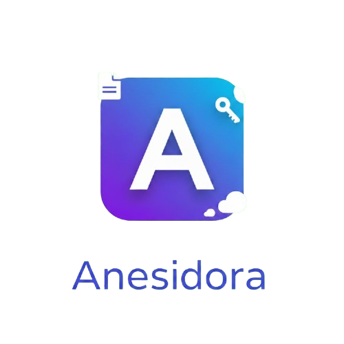

<div align="center">
    
</div>

[](https://laravel.com)
[](https://vuejs.org)
[](https://tailwindcss.com)
[](LICENSE)
[](https://wakatime.com/badge/github/RyannKim327/Anesidora)

Anesidora is a secure, premium file-sharing and file hosting web application built with **Laravel** and **Vue.js**. Inspired by **Anesidora** (meaning "giver of gifts" in Greek mythology), this platform allows users to share files as "gifts" with secure links, passwords, and custom metadata.

---

## 👨‍💻 Developer Information
* **Lead Developer:** MPOP Reverse II [Ryann Kim Sesgundo]

---

## 💡 Project Context & Idea
The primary mission of **Anesidora** is to make sharing files a premium, secure, and interactive experience:
1. **Gift-Giving Paradigm:** Sharing a file is treated as sending a gift. Each shared asset can include a title, detailed description, and custom security settings.
2. **Robust Security:** Support for password-protecting downloads, setting strict link expiration limits, and managing visibility via public/private URLs.
3. **Single Page Experience:** Built as a modern SPA (Single Page Application) for fluid navigation without page reloads.

---

## 🎨 Design Philosophy
Anesidora features a **dark color-based theme** that emphasizes high-contrast modern elements:
* **Background Palette:** Deep slate-blue backdrop (`#1a1a2e`) representing nighttime and deep space.
* **SPA Architecture:** Seamless transitions between views using Vue Router, making the app feel like a native desktop experience.
* **Glow & Gradients:** Vibrant neon violet-to-pink gradients (`#8b5cf6` to `#c084fc`) symbolizing glowing mystical gifts.
* **Premium Glassmorphism:** Backdrop filters, semi-transparent borders, and glowing box shadows to build a high-fidelity visual experience.

---

## 🛠️ Tech Stack & Versions
* **Backend:** PHP `^8.3`, Laravel `^13.8`
* **Frontend:** Vue.js `3.x` (Composition API), Vue Router `4.x`
* **Styling:** Tailwind CSS `^4.3.0`
* **Build Tool:** Vite `^8.0.0`
* **Database:** SQLite (Local file-based)

---

## 🚀 Getting Started

### Prerequisites
- PHP ^8.3
- Node.js & NPM
- Composer

### Installation
1. Clone the repository
2. Install dependencies:
   ```bash
   composer install
   npm install
   ```
3. Set up environment:
   ```bash
   cp .env.example .env
   php artisan key:generate
   ```
4. Run migrations:
   ```bash
   php artisan migrate
   ```

### Running the Application
You need two terminals running simultaneously:

**Terminal 1 (Backend):**
```bash
php artisan serve
```

**Terminal 2 (Frontend):**
```bash
npm run dev
```

---

## 📂 File Structure (Vue SPA)

* 📂 **[resources/js/](file:///home/mpop/Programming/php/Anesidora/resources/js)** — Main Vue Application
  * 📄 **[app.js](file:///home/mpop/Programming/php/Anesidora/resources/js/app.js)** — Vue initialization and mount logic.
  * 📄 **[router.js](file:///home/mpop/Programming/php/Anesidora/resources/js/router.js)** — Client-side routing definitions.
  * 📄 **[App.vue](file:///home/mpop/Programming/php/Anesidora/resources/js/App.vue)** — Root component with router outlet.
  * 📂 **[views/](file:///home/mpop/Programming/php/Anesidora/resources/js/views)** — Page components (Home, Login, Register, Upload, Drive).
  * 📂 **[components/](file:///home/mpop/Programming/php/Anesidora/resources/js/components)** — Reusable UI components (Navbar, Card).
* 📂 **[routes/](file:///home/mpop/Programming/php/Anesidora/routes)**
  * 📄 **[web.php](file:///home/mpop/Programming/php/Anesidora/routes/web.php)** — Laravel catch-all route for the SPA.
* 📂 **[app/](file:///home/mpop/Programming/php/Anesidora/app)** — Core Laravel backend logic (Controllers, Models).

---

## 🎓 License
This project is open-sourced under the **MIT License**. 

---

## 🤝 Credits & Acknowledgements
* **Google Gemini:** Assisted with drafting configuration details, generating clean architectural plans, and code reviews.
* **AntiGravity:** Designed the file/folder structural documentation format and naming conventions.
