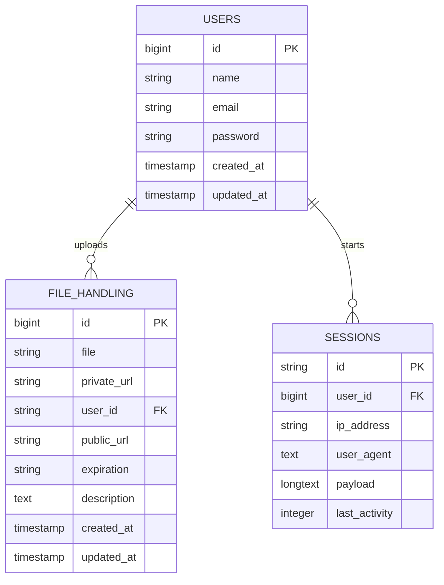

# Anesidora 🎁

Anesidora is a secure, premium file-sharing and file hosting web application built on top of Laravel. Inspired by **Anesidora** (meaning "giver of gifts" in Greek mythology, an epithet of Pandora), this platform allows users to package files with passwords, expiry times, and descriptions, generating secure public or private download links.

---

## 👨‍💻 Developer Information
* **Lead Developer:** MPOP Reverse II [Ryann Kim Sesgundo]

---

## 💡 Project Context & Idea
The primary mission of **Anesidora** is to make sharing files a premium, secure, and interactive experience:
1. **Gift-Giving Paradigm:** Sharing a file is treated as sending a gift. Each shared asset can include a title, detailed description, and a custom configuration.
2. **Robust Security:** Support for password-protecting downloads, setting strict link expiration limits (e.g., `1h`, `24h`, `7d`, `30d`), and managing visibility via public/private URLs.
3. **Immersive User Flow:** Includes interactive layouts ranging from custom registration and upload panels with live upload progress simulation, to sleek file download dashboards detailing the expiration countdown and meta-information.

---

## 🎨 Design Philosophy
Anesidora features a **dark color-based theme** that emphasizes high-contrast modern elements:
* **Background Palette:** Implements a deep slate-blue/midnight-black backdrop (`#0f0f1f`, `#06060c`) representing nighttime and deep space.
* **Glow & Gradients:** Employs vibrant neon violet-to-pink gradients (`from-violet-600 to-pink-600` or `#7c3AED` to `#DB2777`) symbolizing glowing mystical gifts.
* **Premium Glassmorphism:** Incorporates backdrop filters (`backdrop-blur-md`), thin, semi-transparent borders (`border-slate-800/80`), and glowing box shadows (`shadow-[0_0_15px_rgba(124,58,237,0.3)]`) to build a high-fidelity visual experience.
* **Micro-Interactions:** Custom tabs and button hovers feature transitions that make the app feel alive and responsive.

---

## 🛠️ Tech Stack & Versions
* **PHP:** `^8.3` (Core Backend Language)
* **Laravel Framework:** `^13.8` (Application Skeleton & ORM)
* **Tailwind CSS:** `^4.3.0` (Utility-First CSS Styling Engine)
* **Vite:** `^8.0.0` (Frontend Compilation Pipeline)
* **Database Engine:** SQLite (Local file-based SQL store)
* **Additional Utilities:**
  * `concurrently` (`^9.0.1`): Used for launching multiple dev servers (Vite, Artisan serve, logs, and queue listeners) simultaneously.
  * `@tailwindcss/vite` (`^4.3.0`): Integration plugin for Vite.
  * `laravel-vite-plugin` (`^3.1`): Bridging Laravel assets with Vite.

---

## 📂 File Structure & Purpose

Here is an overview of the key directories and files within the codebase:

* 📂 **[app/](file:///home/mpop/Programming/php/Anesidora/app)** — Core Laravel backend directory.
  * 📂 **[app/Models/](file:///home/mpop/Programming/php/Anesidora/app/Models)** — Database Eloquent Models mapping SQLite tables.
    * 📄 **[User.php](file:///home/mpop/Programming/php/Anesidora/app/Models/User.php)** — Class representing user profiles, authentication credentials, and casts.
    * 📄 **[FileHandling.php](file:///home/mpop/Programming/php/Anesidora/app/Models/FileHandling.php)** — Class representing shared assets, validation limits, URLs, and relationships.
  * 📂 **[app/Http/Controllers/](file:///home/mpop/Programming/php/Anesidora/app/Http/Controllers)** — Request routing handlers.
    * 📄 **[UploadController.php](file:///home/mpop/Programming/php/Anesidora/app/Http/Controllers/UploadController.php)** — Controller implementing size constraints, password security checks, expiration mapping, and upload operations.
* 📂 **[config/](file:///home/mpop/Programming/php/Anesidora/config)** — Configuration declarations (database, mail, session, logging).
* 📂 **[database/](file:///home/mpop/Programming/php/Anesidora/database)** — Database initialization files.
  * 📂 **[database/migrations/](file:///home/mpop/Programming/php/Anesidora/database/migrations)** — Schema scripts definition files.
* 📂 **[resources/](file:///home/mpop/Programming/php/Anesidora/resources)** — Frontend templates and raw design assets.
  * 📂 **[resources/views/](file:///home/mpop/Programming/php/Anesidora/resources/views)** — Blade templates.
    * 📄 **[app.blade.php](file:///home/mpop/Programming/php/Anesidora/resources/views/app.blade.php)** — The central layout template embedding tailwind CSS files, setting global metadata, and enclosing core layout wrapper styling.
    * 📄 **[index.blade.php](file:///home/mpop/Programming/php/Anesidora/resources/views/index.blade.php)** — Interactive layout switcher housing simulated upload overlays and custom layout tabs.
    * 📂 **[resources/views/components/](file:///home/mpop/Programming/php/Anesidora/resources/views/components)** — Reusable visual elements.
      * 📄 **[login-form.blade.php](file:///home/mpop/Programming/php/Anesidora/resources/views/components/login-form.blade.php)** — UI component for user credentials and layout entry.
      * 📄 **[upload-form.blade.php](file:///home/mpop/Programming/php/Anesidora/resources/views/components/upload-form.blade.php)** — Interactive drag-and-drop secure uploader configuration form.
      * 📄 **[file-view.blade.php](file:///home/mpop/Programming/php/Anesidora/resources/views/components/file-view.blade.php)** — Interface display panel for public downloading, including password input, and meta descriptors.
  * 📂 **[resources/css/](file:///home/mpop/Programming/php/Anesidora/resources/css)**
    * 📄 **[app.css](file:///home/mpop/Programming/php/Anesidora/resources/css/app.css)** — Custom CSS containing Tailwind CSS v4 imports.
* 📂 **[routes/](file:///home/mpop/Programming/php/Anesidora/routes)** — Routing rules file mapping endpoints.
  * 📄 **[web.php](file:///home/mpop/Programming/php/Anesidora/routes/web.php)** — Declarations for page loading paths, forms submissions, user logins, and database testing hooks.
* 📄 **[composer.json](file:///home/mpop/Programming/php/Anesidora/composer.json)** — Core PHP dependency list.
* 📄 **[package.json](file:///home/mpop/Programming/php/Anesidora/package.json)** — Core JS dependency list.
* 📄 **[vite.config.js](file:///home/mpop/Programming/php/Anesidora/vite.config.js)** — Bundler build pipeline.

---

## 🗄️ Database Architecture
Below is the Entity-Relationship Diagram representing Anesidora's current database structure using SQLite:

### Table Details:
1. **`users`:** Represents registered uploaders/members.
2. **`file_handling`:** Contains metadata for uploaded files, links, security status (passwords/descriptions), and expiration guidelines. It references `user_id` back to the parent `users` table.
3. **`sessions`:** Holds active application sessions, tracking client IP address, payload, and user association for security and session state persistence.

---

## 🎓 License
This project is open-sourced under the **MIT License**. You are free to use, modify, and distribute this software for educational, personal, or non-commercial purposes. 

---

## 🤝 Credits & Acknowledgements
* **Google Gemini:** Assisted with drafting configuration details, generating clean architectural plans, and code reviews.
* **AntiGravity:** Designed the file/folder structural documentation format, naming ideas, and dark-theme UI architecture context for **Anesidora**.
